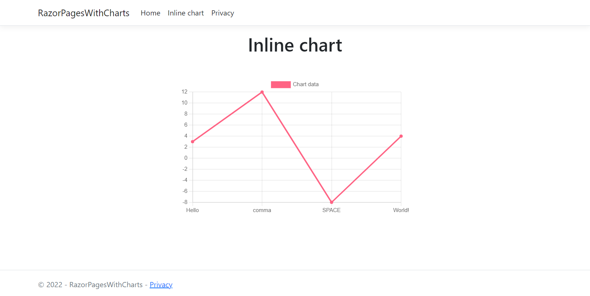

# RazorPagesWithCharts

The example of how to use [Chart.js](https://www.chartjs.org/) with ASP.Net Razor Pages.

## How to run

Ensure you have Visual Studio 2022 installed with .Net 6.0

1. Open the solution in Visual Studio.
2. Start the project.
3. Navigate to **Inline chart** to see the chart.